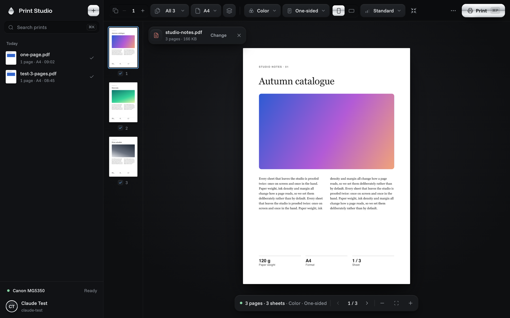
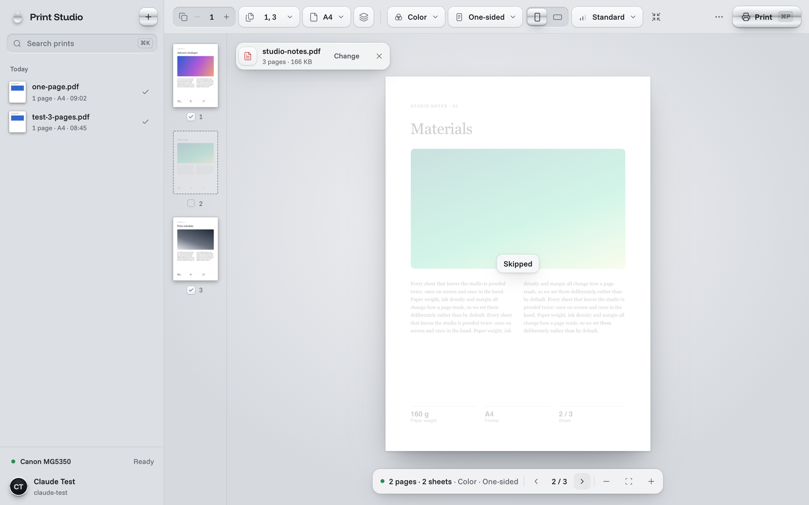
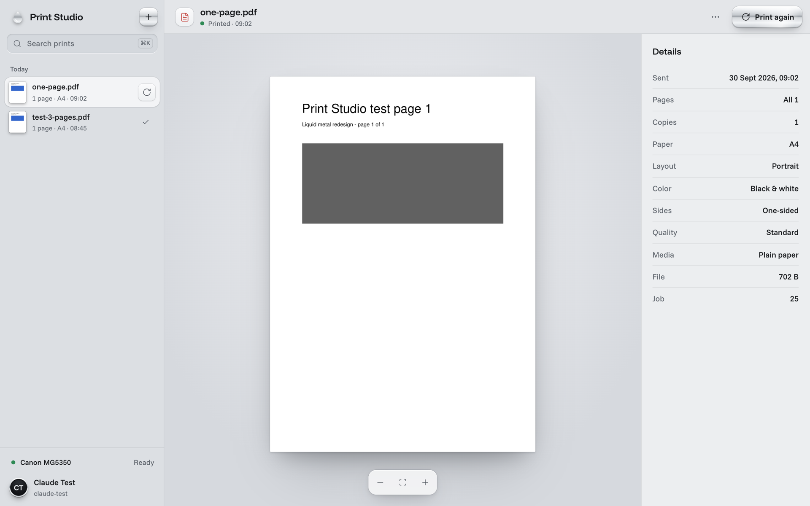
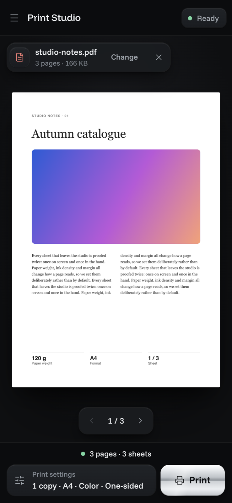
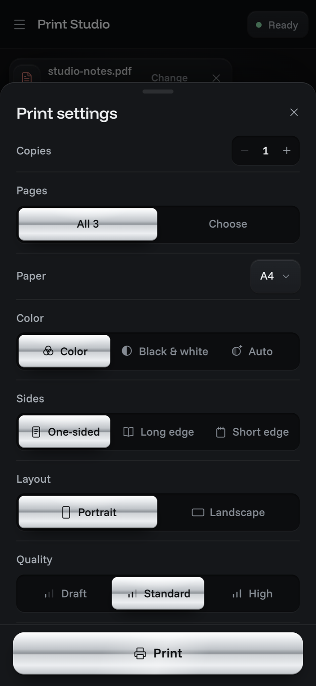
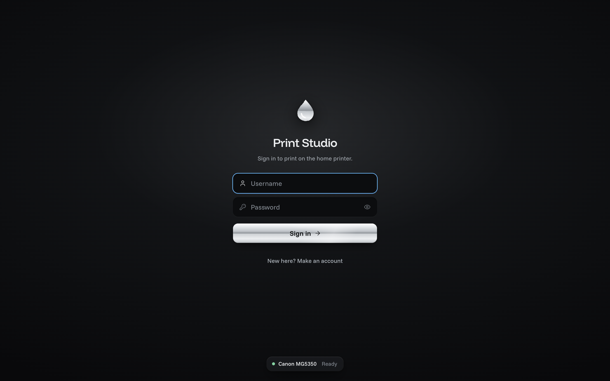

# Print Studio

A web front end for [local_printer_api](https://github.com/jhgrzybowski/local_printer_api): one place on the home LAN to sign in, drop a file, see exactly what will print, set the output, print, and follow the job to the end.

The look is a liquid-metal studio: a graphite (or cool steel) desk with one lit sheet of paper on it. Print history sits in the sidebar, the preview fills the main pane, and every print preference lives in a single toolbar row. Polished chrome marks only what commits or is chosen: Print, the selected option, New print. Controls are minimal icons with tooltips, set in Funnel Sans and Funnel Display. It has light and dark themes and five accent palettes (Cobalt, Iris, Jade, Ember, Graphite). On a phone the toolbar gives way to a print dock with a large Print button and a settings sheet you can swipe away.

## Screenshots



| Light theme, page 2 skipped | History detail |
| --- | --- |
|  |  |

| Phone: print dock | Phone: settings sheet | Sign in |
| --- | --- | --- |
|  |  |  |

## What it does

It covers every endpoint that `local_printer_api` serves:

| Area | In the app | API |
| --- | --- | --- |
| Auth | Sign in, create an account, session restore, sign out | `POST /auth/signup`, `/auth/login`, `/auth/logout`, `GET /auth/me` |
| Printer | A status dot and one word in the sidebar (and the phone top bar), details in Settings | `GET /status`, `/health`, `/options`, `/capabilities` |
| Upload | Drop, paste, or browse. Shows upload progress and the Office→PDF conversion wait, and retries automatically on 503 | `POST /files` |
| Preview | Real page renders on a sheet sized to the chosen paper and orientation. A thumbnail rail lets you include or exclude pages, and B&W, copies and fit to page show on the sheet | `GET /files/{id}`, `/files/{id}/preview`, `/files/{id}/preview/{page}`, `/files/{id}/pdf` |
| Options | Copies, pages, paper, orientation, color, two-sided, quality, paper type, and fit to page. The choices come from the printer at runtime | `GET /options` |
| Check | A dry run on every change, showing sheet count, warnings, and unsupported options | `POST /print/validate` |
| Print | Chrome Print key in the toolbar (also Ctrl/⌘+P or Ctrl/⌘+Enter; Ctrl/⌘+K searches history), or the Print button in the phone dock. Then a job chip with a progress track follows the job (Sent, Queued, Printing, Printed) and offers Cancel | `POST /print`, `GET /jobs/{id}` |
| Jobs | Cancel an active job, or clear a finished one from the queue | `DELETE /jobs/{id}`, `POST /jobs/{id}/forget`, `GET /jobs?scope=all` |
| History | Sidebar grouped by day, with search and infinite scroll. The detail view has a read-only preview and a "Print again" action | `GET /history`, `/history/{id}` |
| Preferences | Saved print defaults, stored per user | `GET/PUT /me/preferences` |
| Language | English or Polish, following the system by default. Change it in Settings → Appearance; the choice is stored per browser | — |

## Run it

The backend must already be running at `http://192.168.100.99:8000`.

### Production (Docker, port 80)

```bash
docker compose up -d --build
```

This serves the app at http://192.168.100.99/. nginx in the container serves the static build and proxies `/api/` to the backend. That keeps the session cookie same-origin, so no CORS setup is needed. To point at a different backend, set `PRINTER_API_UPSTREAM` (for example `http://local-printer-api:8000` on a shared Docker network).

The port binds to the LAN address only. Don't expose it, or the API, to the internet.

### Development

```bash
npm install
npm run dev
```

Open http://192.168.100.99:5173, not `localhost`: the session cookie isn't sent cross-site, so auth would fail. Vite proxies `/api` to the backend. Use `PRINTER_API_TARGET` to override the target.

### Development on the printer host (Docker, port 5173)

The host has no Node, so the dev server runs in a `node:22-alpine` container next to production:

```bash
docker compose -f deploy/docker-compose.dev.yml up -d
```

It serves the source tree with hot reload at http://192.168.100.99:5173/ against the same backend. Its compose project (`print-studio-dev`) is separate from production, so the two never touch.

The host also advertises `drukarka.local` over mDNS (an avahi alias), so on the LAN the dev app is at http://drukarka.local:5173/. `vite.config.js` lists that name in `server.allowedHosts`; Vite rejects any other hostname.

### Checks

```bash
npm run check
```

This runs the unit tests (`node --test`) for page ranges, the print-settings model and translations. The translation tests check Polish plurals and fail if any interface string lacks a Polish entry. The Docker build runs them too, before building.

### Translations

Strings live in the code in English and go through `t()` / `tn()` from `src/i18n/index.js`. Polish is in `src/i18n/pl.js`. A key with a `context|` prefix is used where one English word needs different Polish words. The Polish terms follow Canon, Brother and Windows print dialogs. The header of `pl.js` lists the sources and the false friends it avoids.

## Layout

```
src/
  api/client.js        fetch wrapper, XHR upload with progress, 401 handling
  i18n/                language preference, t()/tn() with plural rules, Polish strings
  hooks/               session, printer status, options, history + job polling, preferences, appearance, print flow
  lib/                 page ranges, settings model, printer status interpretation, formatting
  components/          Sidebar, Toolbar, DropZone, PreviewStage, Dock, PrintSheet, Options, HistoryDetail, SettingsView, AuthScreen, PrinterStatus, controls, glyphs
  styles/              tokens (OKLCH palettes, elevation, metal), base, controls, shell, work, pages
deploy/nginx.conf.template
Dockerfile, docker-compose.yml
```

## Current state

Version 0.2.0 ("liquid metal") is a full redesign of the interface. The functionality is the same as 0.1.0.

The screens:
- **Studio (desktop):** print history in the sidebar; the preview in the main pane; a toolbar of print preferences above it. Pages can be skipped by clicking their thumbnails. A job chip tracks the running print and has a Cancel button.
- **Studio (phone and narrow tablet, up to 860 px):** a slim top bar showing printer status. A bottom print dock pairs a settings summary with a large Print button. The summary opens a settings sheet that can be dismissed by dragging down. The sheet has a page-range field that is checked against the page count.
- **History detail:** the preview, a list of facts about the print, Print again, and a More menu with Open PDF and Clear from printer queue.
- **Settings, sign-in and registration:** a single column with an account avatar.
- **Languages:** English and Polish. In Polish, the studio, history detail and Settings were checked at 1440 px, and the phone print sheet at 390 px.

Verified on the dev deployment (http://192.168.100.99:5173) with Playwright, at 1440 and 1100 px (dark and light themes) and at 390 px as a touch phone (dark theme):
- Sign in (including a wrong password), registration, and upload of PDF, PNG and text files. Rejection of an unsupported file.
- Page skipping and page-range validation, the settings sheet, and the drawer, history detail, More menu and settings.
- Two real one-page black-and-white prints (one sent from the phone layout), followed from Sent to Printed.
- The production build and unit tests.

Not yet done:
- **Cancel on a live job.** The Cancel button appears while a job runs, but cancelling was not tried on a real job.
- **Code splitting.** The JS bundle is about 190 kB gzipped.
- **Server messages.** Error text that comes from the backend is not translated.

Design notes are in [DESIGN.md](DESIGN.md); product context is in [PRODUCT.md](PRODUCT.md).
